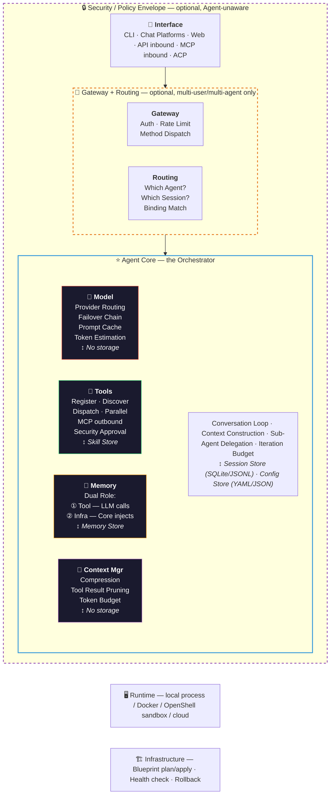
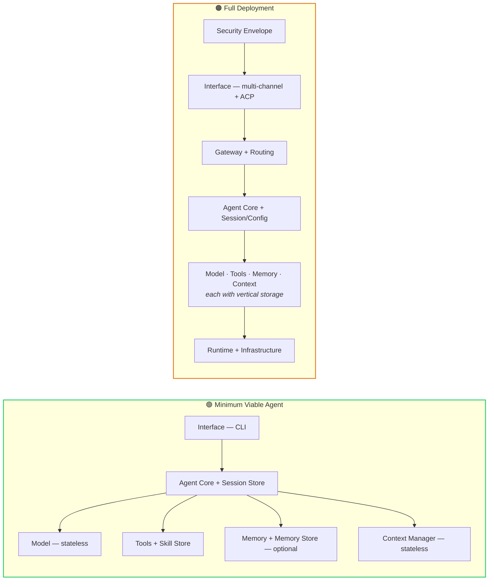

# Build Your Own Agent

**[中文版 →](README_zh.md)**

> **What I cannot create, I do not understand.** — Richard Feynman

4 production Agent projects. ~600,000 lines of code. Distilled into 11 architecture modules and 6 emergent behavior patterns.

This is a step-by-step guide to building AI Agents from scratch — not from theory, not from framework docs, but from patterns extracted from real, working code.

## Architecture Overview

The first thing we learned: **Agent architecture is not layered. It's Hub-and-Spoke.** Agent Core sits at the center as the orchestrator. Model, Tools, Memory, and Context Manager orbit around it as peer services.

We started by drawing a neat layered diagram. The code told a different story. After 5 rounds of verification and correction against all 4 codebases, we arrived at this reference model.

## The 4 Projects We Analyzed

| Project | What It Is | Language | Lines | Key Innovation |
|---------|-----------|----------|-------|----------------|
| [hermes-agent](https://github.com/NousResearch/hermes-agent) | Self-evolving AI Agent | Python | ~80K | Learning loop — creates skills from experience |
| [openclaw](https://github.com/open-claw/open-claw) | Local-first multi-channel AI gateway | TypeScript | ~300K | Plugin ecosystem + 20 platform adapters |
| [NemoClaw](https://github.com/nvidia/NemoClaw) | Agent security sandbox runtime | JS/TS | ~20K | Landlock + seccomp process-level isolation |
| [Claude Code](https://claude.ai/code) | Anthropic's official CLI Agent | TS/React/Bun | ~200K | Speculative execution + enterprise engineering |

## Table of Contents

### Part I: Architecture Modules

Build your Agent one module at a time. Start with the core 5, add the rest as needed.

**Core Modules — start here:**

| # | Module | What It Does |
|---|--------|-------------|
| 1 | [Agent Core](modules/01-agent-core.md) | The conversation loop — `while(budget > 0): call model → exec tools → repeat` |
| 2 | [Model Service](modules/02-model-service.md) | LLM integration, provider routing, failover chains |
| 3 | [Tools](modules/03-tools.md) | Registration, dispatch, parallel execution, security approval |
| 4 | [Memory](modules/04-memory.md) | Dual role: LLM-callable tool + system prompt infrastructure |
| 5 | [Context Manager](modules/05-context-manager.md) | Multi-strategy compression to fit the context window |

**Supporting Modules — add when needed:**

| # | Module | What It Does |
|---|--------|-------------|
| 6 | [Interface](modules/06-interface.md) | CLI, messaging platforms, web, API/MCP inbound |
| 7 | [Gateway + Routing](modules/07-gateway-routing.md) | Auth, rate limiting, multi-agent message routing |
| 8 | [Security Envelope](modules/08-security-envelope.md) | OS-level file, network, and process isolation |
| 9 | [Storage](modules/09-storage.md) | Vertical storage per service — not a horizontal layer |
| 10 | [Runtime + Infrastructure](modules/10-runtime-infra.md) | Local process, Docker, sandbox, cloud deployment |
| 11 | [Cross-cutting Concerns](modules/11-cross-cutting.md) | Observability, plugin framework, hot config reload |

### Part II: Emergent Behaviors

The real magic. These capabilities don't exist as classes or modules — they **emerge** from the interaction of simple components.

| # | Behavior | What Emerges |
|---|----------|-------------|
| 1 | [Learning Loop](emergent-behaviors/01-learning-loop.md) | Agent creates skills from experience, loads them next session, patches when wrong |
| 2 | [Speculative Execution](emergent-behaviors/02-speculative-execution.md) | Permission prompt and tool execution run in parallel |
| 3 | [Self-Healing Model Routing](emergent-behaviors/03-self-healing-routing.md) | Main model fails → auto-switch → cooldown → probe → auto-recover |
| 4 | [Context Pressure Cascade](emergent-behaviors/04-context-pressure-cascade.md) | Multi-level compression: prune → summarize → truncate + cooperative degradation |
| 5 | [Sub-Agent Delegation](emergent-behaviors/05-sub-agent-delegation.md) | Parent spawns isolated child Agent with limited budget and tools |
| 6 | [Multi-Agent Specialization](emergent-behaviors/06-multi-agent-specialization.md) | Messages route to specialized Agents via binding rules |

### Part III: Practical Guides

| Guide | What You'll Learn |
|-------|------------------|
| [Minimum Viable Agent](guides/minimum-viable-agent.md) | Build the simplest working Agent with 5 core components |
| [Modularization Strategy](guides/modularization-strategy.md) | When to split modules, when not to — the 3-phase evolution |
| [Testing Emergent Behaviors](guides/testing-emergent-behaviors.md) | Loop tests that verify cross-module behaviors still work |

### Part IV: Cross-project Analysis

| Analysis | What It Covers |
|----------|---------------|
| [Four Projects Overview](comparisons/four-projects-overview.md) | Static architecture + dynamic behavior comparison tables |
| [vs Claude Architect Certification](comparisons/vs-claude-architect-cert.md) | What our code analysis validates — and what goes beyond |
| [Reading List](resources/reading-list.md) | Source repos, papers, and external tutorials |

## Quick Start

**Building an Agent from scratch?**
1. Read [Agent Core](modules/01-agent-core.md) — understand the conversation loop
2. Add [Model](modules/02-model-service.md) and [Tools](modules/03-tools.md) — your Agent can think and act
3. Add [Memory](modules/04-memory.md) — your Agent remembers across sessions
4. Add [Context Manager](modules/05-context-manager.md) — stays coherent in long conversations
5. Wire it together with the [Minimum Viable Agent](guides/minimum-viable-agent.md) guide

**Understanding Agent architecture?** Start with the [Four Projects Overview](comparisons/four-projects-overview.md).

**Studying for Claude Architect certification?** Read the [vs Certification](comparisons/vs-claude-architect-cert.md) analysis.

## Minimum Viable vs Full Deployment

You don't need all 11 modules to start. A minimum viable Agent needs just 5 core components (left). Add the rest as your requirements grow (right). See the [Minimum Viable Agent](guides/minimum-viable-agent.md) guide for details.

## Four Projects: Who Implements What Best

| Module | Best Implementation | Why |
|--------|-------------------|-----|
| Agent Core | **openclaw** (cleanest) or hermes (simplest) | openclaw: Hook-based coordination. hermes: one-file approach |
| Model | **openclaw** failover + Claude Code DI | Candidate chain + cooldown probing is production-essential |
| Tools | hermes (simple) or **openclaw** Plugin SDK (platform) | Self-registration for solo; SDK if third parties extend |
| Memory | **hermes** Provider ABC + openclaw dual-register | hermes: best abstraction. openclaw: best dual-role wiring |
| Context | **Claude Code** 3-strategy or openclaw pluggable engine | 3-strategy most flexible; pluggable most extensible |
| Gateway | **openclaw** | Only project that does it properly (WS control plane, 25+ handlers) |
| Security | **NemoClaw** | Only project serious about it (Landlock + per-binary network + seccomp) |
| Runtime/Infra | **NemoClaw** | Only project that built it (Blueprint plan/apply/rollback) |

## Methodology

We didn't design this architecture from principles. We **extracted** it from code.

1. Read all 4 codebases cover-to-cover (~600K lines)
2. Drew an initial architecture diagram (it was wrong)
3. Verified against code, found mismatches, corrected
4. Repeated for 5 rounds until the model matched all 4 projects
5. Identified 6 emergent behaviors that no single component creates
6. Cross-validated against the [Claude Certified Architect](https://github.com/paullarionov/claude-certified-architect) knowledge base — [results here](comparisons/vs-claude-architect-cert.md)

## Contributing

Found an error? Have a better example from another Agent project? PRs welcome.

- Each module guide follows a consistent 7-section template
- Emergent behavior guides follow an 8-section template
- New patterns welcome if backed by code evidence
- Translations to other languages appreciated

## License

[CC BY-SA 4.0](https://creativecommons.org/licenses/by-sa/4.0/) — Share and adapt with attribution.
