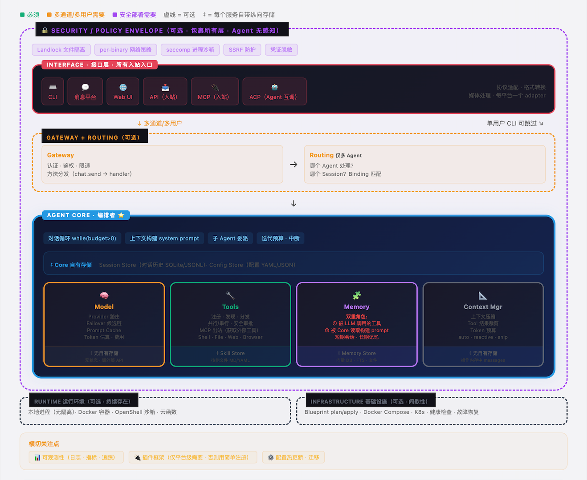
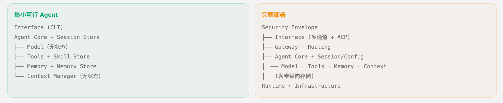
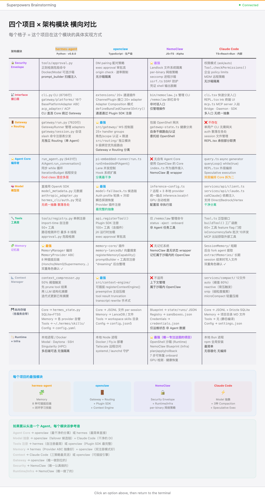

# 从零构建你自己的 AI Agent

**[English Version →](README.md)**

> **我不能创造的东西，我就不理解。** — 理查德·费曼

4 个生产级 Agent 项目，约 60 万行代码，拆解为 11 个架构模块和 6 个涌现行为模式。

这是一份从零构建 AI Agent 的分步指南 — 不是理论，不是框架文档，是从真实代码里提炼出来的架构模式。

## 架构全景

第一个发现：**Agent 架构不是分层的，是 Hub-and-Spoke（中心辐射型）。** Agent Core 坐在中心编排，Model、Tools、Memory、Context Manager 作为对等服务环绕。

我们一开始画了整齐的分层图。代码告诉我们那是错的。经过对 4 个项目代码的 5 轮验证和修正，最终得出了上面的参考模型。

## 我们分析的 4 个项目

| 项目 | 定位 | 语言 | 代码量 | 核心创新 |
|------|------|------|-------|---------|
| [hermes-agent](https://github.com/NousResearch/hermes-agent) | 自进化 AI Agent | Python | ~8 万行 | 闭环学习 — 从经验中创建技能 |
| [openclaw](https://github.com/open-claw/open-claw) | 本地优先多通道 AI 网关 | TypeScript | ~30 万行 | 插件生态 + 20 个平台 adapter |
| [NemoClaw](https://github.com/nvidia/NemoClaw) | Agent 安全沙箱运行时 | JS/TS | ~2 万行 | Landlock + seccomp 进程级隔离 |
| [Claude Code](https://claude.ai/code) | Anthropic 官方 CLI Agent | TS/React/Bun | ~20 万行 | 推测性执行 + 企业级工程 |

## 目录

### Part I：架构模块

一次一个模块，构建你的 Agent。先从核心 5 个开始，按需添加其余模块。

**核心模块 — 从这里开始：**

| # | 模块 | 做什么 |
|---|------|-------|
| 1 | [Agent Core](zh/modules/01-agent-core.md) | 对话循环 — `while(预算 > 0): 调模型 → 执行工具 → 重复` |
| 2 | [Model 服务](zh/modules/02-model-service.md) | LLM 集成、Provider 路由、Failover 候选链 |
| 3 | [Tools 工具](zh/modules/03-tools.md) | 注册、分发、并行执行、安全审批 |
| 4 | [Memory 记忆](zh/modules/04-memory.md) | 双重角色：LLM 可调用的工具 + system prompt 基础设施 |
| 5 | [Context Manager](zh/modules/05-context-manager.md) | 多策略压缩，管好有限的上下文窗口 |

**支撑模块 — 按需添加：**

| # | 模块 | 做什么 |
|---|------|-------|
| 6 | [Interface 接口层](zh/modules/06-interface.md) | CLI、消息平台、Web、API/MCP 入站 |
| 7 | [Gateway + Routing](zh/modules/07-gateway-routing.md) | 认证、限速、多 Agent 消息路由 |
| 8 | [Security Envelope](zh/modules/08-security-envelope.md) | OS 级文件、网络、进程隔离 |
| 9 | [Storage 存储](zh/modules/09-storage.md) | 每个服务的纵向存储 — 不是水平层 |
| 10 | [Runtime + Infra](zh/modules/10-runtime-infra.md) | 本地进程、Docker、沙箱、云部署 |
| 11 | [横切关注点](zh/modules/11-cross-cutting.md) | 可观测性、插件框架、配置热更新 |

### Part II：涌现行为

真正的魔法。这些能力不存在于任何类或模块中 — 它们从简单组件的交互中**涌现**。

| # | 行为 | 涌现了什么 |
|---|------|-----------|
| 1 | [学习闭环](zh/emergent-behaviors/01-learning-loop.md) | Agent 从经验中创建技能，下次加载，发现不对时修补 |
| 2 | [推测性执行](zh/emergent-behaviors/02-speculative-execution.md) | 权限弹窗和工具执行并行运行 |
| 3 | [自愈式模型路由](zh/emergent-behaviors/03-self-healing-routing.md) | 主模型挂了 → 自动切换 → 冷却 → 探测 → 自动恢复 |
| 4 | [上下文压力级联](zh/emergent-behaviors/04-context-pressure-cascade.md) | 多级压缩：裁剪 → 摘要 → 截断 + 协作降级 |
| 5 | [子 Agent 委派](zh/emergent-behaviors/05-sub-agent-delegation.md) | 父 Agent 生成隔离的子 Agent，受限预算和工具 |
| 6 | [多 Agent 专业化](zh/emergent-behaviors/06-multi-agent-specialization.md) | 消息通过路由规则分配到专业化 Agent |

### Part III：实操指南

| 指南 | 你会学到什么 |
|------|------------|
| [最小可行 Agent](zh/guides/minimum-viable-agent.md) | 用 5 个核心组件构建最简单的可用 Agent |
| [模块化策略](zh/guides/modularization-strategy.md) | 什么时候拆、什么时候不拆 — 三阶段演进 |
| [涌现行为测试](zh/guides/testing-emergent-behaviors.md) | 验证跨模块行为的闭环测试 |

### Part IV：跨项目分析

| 分析 | 覆盖内容 |
|------|---------|
| [四项目总览](zh/comparisons/four-projects-overview.md) | 静态架构 + 动态行为横向对比表 |
| [vs Claude Architect 认证](zh/comparisons/vs-claude-architect-cert.md) | 我们的代码分析验证了什么，又超越了什么 |
| [推荐阅读](resources/reading-list.md) | 源码仓库、论文、外部教程 |

## 快速上手

**从零造 Agent？**
1. 先读 [Agent Core](zh/modules/01-agent-core.md) — 理解对话循环
2. 加上 [Model](zh/modules/02-model-service.md) 和 [Tools](zh/modules/03-tools.md) — Agent 能思考和行动了
3. 加上 [Memory](zh/modules/04-memory.md) — Agent 能跨会话记忆了
4. 加上 [Context Manager](zh/modules/05-context-manager.md) — 长对话中保持连贯
5. 用 [最小可行 Agent](zh/guides/minimum-viable-agent.md) 指南把它们串起来

**理解 Agent 架构？** 从 [四项目总览](zh/comparisons/four-projects-overview.md) 开始。

**备考 Claude Architect 认证？** 读 [vs 认证](zh/comparisons/vs-claude-architect-cert.md) 分析。

## 最小可行 vs 完整部署

你不需要 11 个模块才能开始。最小可行 Agent 只需要 5 个核心组件（左）。随着需求增长再添加其余模块（右）。详见 [最小可行 Agent](zh/guides/minimum-viable-agent.md) 指南。

## 四个项目 × 全部模块

每个模块，每个项目 — 各自怎么实现的。详见 [四项目总览](zh/comparisons/four-projects-overview.md)。

## 方法论

这个架构不是我们从原理推导的，是从代码里**提取**的。

1. 逐行阅读 4 个项目的代码（约 60 万行）
2. 画了一版架构图（画错了）
3. 对照代码验证，发现不匹配，修正
4. 重复 5 轮，直到模型与 4 个项目全部吻合
5. 识别出 6 个没有对应类或模块的涌现行为
6. 与 [Claude Certified Architect](https://github.com/paullarionov/claude-certified-architect) 知识体系交叉验证 — [结果在这里](zh/comparisons/vs-claude-architect-cert.md)

## 贡献

发现错误？有更好的案例？欢迎 PR。

- 每个模块指南遵循 7 节标准模板
- 涌现行为指南遵循 8 节标准模板
- 欢迎有代码证据支撑的新模式
- 欢迎其他语言的翻译

## 许可

[CC BY-SA 4.0](https://creativecommons.org/licenses/by-sa/4.0/) — 注明出处即可自由分享和改编。

---
